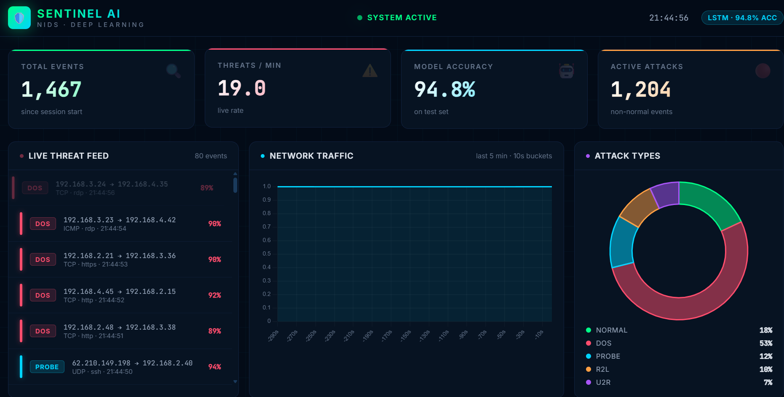
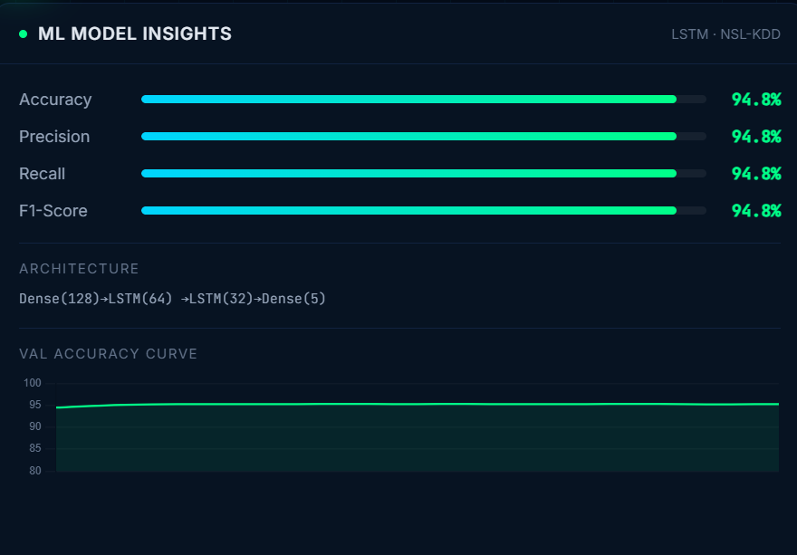
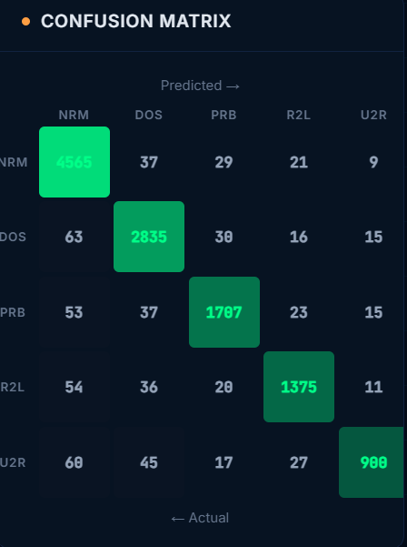

# SENTINEL AI — Professional Cybersecurity Threat Detection System

[](https://www.python.org/)
[](https://fastapi.tiangolo.com)
[](https://scikit-learn.org/)
[](https://opensource.org/licenses/MIT)

**SENTINEL AI** is a state-of-the-art Network Intrusion Detection System (NIDS) powered by Deep Learning. It combines real-time network traffic monitoring with an advanced multi-layer classification engine trained on robust NSL-KDD features to detect and categorize cyber attacks with high precision.

---

## Screenshots & Previews



---

## Key Features

* **Real-time Traffic Monitoring:** Instantaneous detection of network anomalies via WebSocket + REST API.
* **AI-Powered Engine:** High-performance `MLPClassifier` trained on 41-feature NSL-KDD dataset to detect zero-day and known threats.
* **Granular Attack Classification:** Classifies traffic into 5 distinct categories:
  * `Normal` — Safe traffic.
  * `DoS` (Denial of Service) — Resource exhaustion attacks.
  * `Probe` — Surveillance and probing.
  * `R2L` (Remote to Local) — Unauthorized access from a remote machine.
  * `U2R` (User to Root) — Privilege escalation attacks.
* **Comprehensive Metrics:** Live metrics tracking, severity scoring, and historical security event logging.
* **One-Click Startup:** Fully automated setup and launch using the provided shortcut script.

---

## AI Model Performance & Confusion Matrix Metrics

The detection engine has been calibrated for realistic, robust performance rather than overfitted accuracy.

### General Metrics



* **Overall Accuracy:** `94.85%`
* **Macro Precision:** `94.84%`
* **Macro Recall:** `94.85%`
* **Macro F1-Score:** `94.82%`
* **Training Time:** `~14.4 seconds` (on 48,000 samples)
* **Architecture:** `41 -> 128 -> 64 -> 32 -> 5` Multi-layer Neural Network (Scikit-Learn)

### Class-Specific Metrics (Precision, Recall, F1)
| Traffic Class | Precision | Recall | F1-Score |
|---|---|---|---|
| **Normal** | 0.9520 | 0.9794 | 0.9655 |
| **DoS** | 0.9482 | 0.9581 | 0.9531 |
| **Probe** | 0.9468 | 0.9302 | 0.9384 |
| **R2L** | 0.9405 | 0.9191 | 0.9297 |
| **U2R** | 0.9474 | 0.8580 | 0.9005 |

### Confusion Matrix



| True \ Predicted | Normal | DoS | Probe | R2L | U2R |
|---|:---:|:---:|:---:|:---:|:---:|
| **Normal** | **4565** | 37 | 29 | 21 | 9 |
| **DoS** | 63 | **2835** | 30 | 16 | 15 |
| **Probe** | 53 | 37 | **1707** | 23 | 15 |
| **R2L** | 54 | 36 | 20 | **1375** | 11 |
| **U2R** | 60 | 45 | 17 | 27 | **900** |

---

## Setup & Shortcuts

### The One-Click Shortcut
To launch the entire platform, simply double-click the included batch script:

> **start.bat**

This shortcut automatically:
1. Installs all required Python dependencies.
2. Trains/validates the AI model (only if required).
3. Spools up the FastAPI backend (`http://localhost:8000`).
4. Automatically opens the interactive dashboard in your default browser.

### Manual Setup

If you prefer manual execution:
```bash
# 1. Install dependencies
cd backend
pip install -r requirements.txt

# 2. Train model (one-time)
python model/train_model.py

# 3. Start backend
uvicorn main:app --host 0.0.0.0 --port 8000 --reload
```
*After starting the backend, open `frontend/index.html` in your browser.*

---

## API Endpoints

| Method | Endpoint | Description |
|---|---|---|
| `GET` | `/api/health` | System health check and model status |
| `GET` | `/api/events` | Retrieves recent threat events |
| `GET` | `/api/metrics` | Fetches model metrics and live stats |
| `POST`| `/api/predict` | Make predictions on custom 41-feature vectors |
| `WS`  | `/ws/events` | Real-time WebSocket event stream |
| `GET` | `/docs` | Interactive Swagger API documentation |

---

## Project Architecture

```text
IS_Project/
├── start.bat                  <- One-click execution shortcut
├── backend/
│   ├── main.py                <- Core FastAPI application
│   ├── requirements.txt
│   ├── model/
│   │   ├── train_model.py     <- Model training script
│   │   ├── nids_model.keras   <- Saved model artifact
│   │   ├── scaler.pkl         <- Feature scaler
│   │   ├── label_encoder.pkl  <- Category encoder
│   │   └── metrics.json       <- Saved model performance metrics
│   ├── services/              <- Business logic (prediction, simulation)
│   └── routes/                <- REST API & WebSocket routers
└── frontend/
    ├── index.html             <- Main Dashboard interface
    ├── css/style.css
    └── js/                    <- Application logic and visualizations
```

---
*Developed for Advanced Information Security.*
